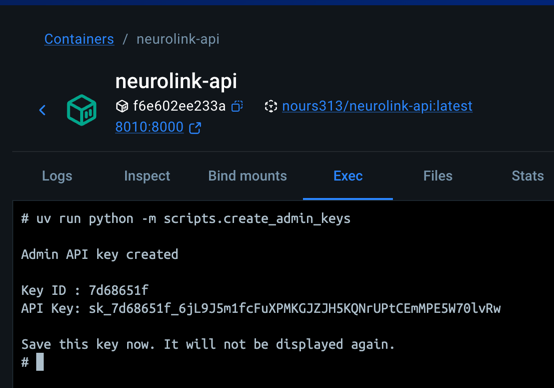

# NeuroLink API

API fournissant le catalogue des implants commercialisés par NeuroLink Corp

## Stack technique

- Python 3.13+
- FastAPI
- SQLAlchemy
- Uvicorn
- SQLite

## Démarrage rapide

L'image docker de l'API est disponible sur DockerHub : [nours313/neurolink-api](https://hub.docker.com/r/nours313/neurolink-api).

Ajouter le service suivant dans votre `docker-compose.yml` :

```yaml
  api:
    image: nours313/neurolink-api:latest
    container_name: neurolink-api
    ports:
      - "8010:8000"
    environment:
      DATABASE_URL: sqlite:///./neurolink_db_docker
    volumes:
      - ./:/app
    command: uv run uvicorn app.main:app --host 0.0.0.0 --port 8000 --reload

```

Démarrer ensuite les containers
```bash
docker compose up --build
```

L'API est exposée sur `http://localhost:8010`.

La documentation Swagger est disponible sur `http://localhost:8010/docs`.

## Génération de la clé admin

Une clé administrateur doit être générée via le script suivant en se connectant sur le container de l'API :

```bash
uv run python -m scripts.create_admin_keys
```

Le script crée une clé API avec le rôle `ADMIN`, affiche son `Key ID` et la valeur complète de la clé, puis recommande de la sauvegarder immédiatement.

Exemple de sortie :




Cette clé est ensuite utilisée pour accéder aux routes protégées de gestion des clés et de l'administration.


## Rôles des clés API

- `User` : accès en lecture aux ressources 
- `Admin` : accès complet, notamment la génération et révocation des clés

